<!-- START doctoc generated TOC please keep comment here to allow auto update -->
<!-- DON'T EDIT THIS SECTION, INSTEAD RE-RUN doctoc TO UPDATE -->
**Table of Contents**  *generated with [DocToc](https://github.com/thlorenz/doctoc)*

- [Getting started](#getting-sarted)
  - [Getting the code](#getting-the-code)
    - [The easy way (CDN-like)](#the-easy-way-cdn-like)
    - [The node way](#the-node-way)
  - [Starting ProtVista](#starting-protvista)
    - [Basic](#basic)
    - [Excluding categories](#excluding-categories)
    - [Preselecting a feature](#preselecting-a-feature)
    - [Customizing the category order](#customizing-the-category-order)
- [Core](#core) 
  - [API](#api)
    - [selectFeature(ftType, begin, end, altSequence)](#selectfeaturefttype-begin-end-altsequence)
    - [Currently supported features](#currently-supported-features)
  - [Events](#events)
- [Data services and formats](#data-services-and-formats)
  - [Default data sources](#default-data-sources)
  - [Default categories and types](#default-categories-and-types)
  - [Data format](#data-format)
    - [Basic visualization](#basic-visualization)
    - [Variant visualization](#variant-visualization)  
- [Adding your own sources](#adding-your-sources)
  - [Distinguishing your features](#distinguishing-your-features)
    - [Using a color](#using-a-color)
    - [Using customized categories or types](#using-customized-categories-or-types)
  - [Variants](#variants)
  - [Further customization](#further-customization)
    - [Default configuration](#default-configuration)
    - [Customized configuration](#customized-configuration)
- [Contributing](#contributing)
- [Support](#support)
- [License](#license)

<!-- END doctoc generated TOC please keep comment here to allow auto update -->

# Getting started

## Getting the code
You will need the ```featuresviewer.min.js``` which contains the minified JavaScript code required to run the application, as well as the CSS file ```main.css``` (general styling, including feature styles and icon fonts).

### The easy way (CDN-like)
We host all our releases on Github, using Github pages as a CDN. The latest release is available here:

```
<script src="http://ebi-uniprot.github.io/CDN/protvista/protvista.js"></script>
<link href="http://ebi-uniprot.github.io/CDN/protvista/css/main.css" rel="stylesheet"/>
```

We also archive previous versions, for instance:

```
<script src="http://ebi-uniprot.github.io/CDN/protvista/2.0.1/protvista.js"></script>
<link href="http://ebi-uniprot.github.io/CDN/protvista/2.0.1/css/main.css" rel="stylesheet"/>
```

Our viewer was previously know as biojs-vis-proteinfeaturesviewer, that name is now **deprecated** and you **should not** use it. For legacy purposes, we keep the versions released under that name.

```
<script src="http://ebi-uniprot.github.io/CDN/feature-viewer/featuresviewer.js"></script>
<link href="http://ebi-uniprot.github.io/CDN/feature-viewer/css/main.css" rel="stylesheet"/>
```

### The node way
`>npm install ProtVista`
This is probably the preferred way if you are developing a new component or application that uses our feature viewer. It would be useful as well if you are modifying this component. Some more information about [node](https://nodejs.org/en/) and [NPM](https://www.npmjs.com/). 

## Starting ProtVista
In order to use this component, you need an HTML element such as <div\> or <span\> or anything else that can act as a container where ProtVista will be located. In the following lines, we use a DIV element identified as *yourDiv*, it could have any other name.
  
<div style="display: table">
  <div style="display: table-row">
      <div style="display: table-cell">
        
      </div>
      
      <div style="display: inline-block">
        Please be aware that directly opening an HTML page in a browser (file:///) might not work in all computers. It 
       depends on OS and security configuration.
      </div>
  </div>
</div> 

### Basic
When creating the instance, you need to specify the object where the component will be located, *el*, as well as the UniProt accession whose sequence annotations will be visualized, *uniprotacc*. We are supposing here that you will instantiate the component as soon as the window has been loaded, i.e., window.onload function.

```html
<div id='yourDiv'/>
<script>
    window.onload = function() {
        var yourDiv = document.getElementById('yourDiv');
        var ProtVista = require('ProtVista');
        var instance = new ProtVista({
            el: yourDiv,
            uniprotacc: 'P05067'
        });
    }
</script>
```

<div id="basicDemo" style="margin-top: 10px"></div>
<div style="visibility: hidden; height: 0px; width:0px">
    
</div>

### Excluding categories
If you are not interested in all the categories supported by ProtVista, you can exclude some of them, make sure you use the right spelling and CAPITAL letters. The available categories are: DOMAINS_AND_SITES, MOLECULE_PROCESSING, PTM, SEQUENCE_INFORMATION, STRUCTURAL, TOPOLOGY, MUTAGENESIS, PROTEOMICS and VARIATION. For more information on features belongin to each category, please read the API section in this guide.

```html
<div id='yourDiv'/>
<script>
    window.onload = function() {
        var yourDiv = document.getElementById('yourDiv');
        var ProtVista = require('ProtVista');
        var instance = new ProtVista({
            el: yourDiv,
            uniprotacc: 'P05067',

            //These categories will **not** be rendered at all
            exclusions: ['SEQUENCE_INFORMATION', 'STRUCTURAL', 'TOPOLOGY', 'MUTAGENESIS', 'MOLECULE_PROCESSING']
        });
    }
</script>
```

<div id="exclusionsDemo" style="margin-top: 10px"></div>
<div style="visibility: hidden; height: 0px; width:0px">
    
</div>

### Preselecting a feature
Of you want to immediately direct attention to a particular feature, you can preselect any of them. For variants, conflict sequences and mutagenesis your will need as well to specify the "alternativeSequence" field.

```html
<div id='yourDiv'/>
<script>
    window.onload = function() {
        var yourDiv = document.getElementById('yourDiv');
        var ProtVista = require('ProtVista');
        var instance = new ProtVista({
            el: yourDiv,
            uniprotacc: 'P05067',
            //This feature will be preselected
            selectedFeature: {
            begin: 96,
            end: 110,
            type: 'REGION'
            }
        });
    }
</script>
```

<div id="preselectionDemo" style="margin-top: 10px"></div>
<div style="visibility: hidden; height: 0px; width:0px">
    
</div>

### Customizing the category order
You can also change the predefined order used to organize the categories one after the other. The predefined order is: Domains and sites, molecule processing, PTMs, sequence information, structural features, topology, mutagenesis, proteomics and variants
 
```html
<div id='yourDiv'/>
<script>
    window.onload = function() {
        var yourDiv = document.getElementById('yourDiv');
        var ProtVista = require('ProtVista');
        var instance = new ProtVista({
            el: yourDiv,
            uniprotacc: 'P05067',
            //These categories will be loaded first, the rest will follow the predefined order.
            categoryOrder: ['DOMAINS_AND_SITES', 'VARIATION', 'PTM']
        });
    }
</script>
```

<div id="orderDemo" style="margin-top: 10px"></div>
<div style="visibility: hidden; height: 0px; width:0px">
    
</div>

# Core

## API
ProtVista offers some public methods that can be used to programmatically interact with the component.

### selectFeature(ftType, begin, end, altSequence)
If you want to select a feature you can use the *selectFeature method*. The parameters ftType, begin and end are mandatory while altSequence is optional. Whenever you want to select variants, mutagenesis or conflict sequences you need to pass the altSequence, i.e., the bit of sequence reported by that feature.

```javascript
<script>
    instance.selectFeature('region', 27, 83);
    instance.selectFeature('act_site', 47, 47);
</script>
```

```javascript
<script>
    instance.selectFeature('variant', 33, 34, 'QH');
    instance.selectFeature('conflict', 53, 58, 'KGLMTW');
    instance.selectFeature('mutagen', 115, 115, 'K');
</script>
```

### Currently supported features
Please take look to the [currently supported categories, types and features](userGuide.html#feature-categories-and-types).

## Events
ProtVista triggers five events. In order to listen to those events, you need to get the dispatcher.

```javascript
instance.getDispatcher().on("ready", function(obj) {
    console.log('ready');
    console.log(obj);
});
```

**ready**
As soon as data from at least one of the data service has been loaded, this event will be triggered. The object provided by this event corresponds to all the data retrieved from the data service plus some parsing, it will be ready to be used by ProtVista or any other JavaScript component.

**noDataAvailable**
Triggered when the protein accession retrieved has no sequence annotations. No object is provided in this case.

**noDataRetrieved**
Triggered when the data failed to be loaded. No object is provided in this case. Check the console logs for errors.

**featureSelected**
As soon as a feature has been selected, meaning a click on it has happened, this event will be triggered. This event will also be triggered after using the method _selectFeature_ if the selection was successful. The object provided by this event looks like:

```javascript
{
  "feature":{
    "type":{"name":"REGION","label":"region of interest"},
    "description":"Heparin-binding",
    "begin":"96",
    "end":"110",
    "internalId":"ft_65"
  },
  "color":"rgb(179, 62, 0)"
}
```

**featureDeselected**
As soon as a feature has been deselected, this event will be triggered. A feature is deselected when it is selected and a clicked on it happens, or when another feature is selected. The object provided by this event looks like the one provided by the event "featureSelected".

**notFound**
Triggered when the method **selectFeature** is used but no corresponding feature has been found. The object provided by this event will contain the information passed as parameters to the method, for instance

```javascript
{
  "ftType": "REGION",
  "begin": 5,
  "end": 27
}
```

# Data services and formats

## Default data sources
By default, ProtVista uses three [RESTful data sources](http://www.ebi.ac.uk/uniprot/api/doc/index.html) provided by the Protein Function Development team. Particularly, it uses the feature data source, the variation data source and the proteomics data source.

The default data sources can be excluded when instantiating the component. Just set defaultSources to false, any other value as well as the omission of this property-key will result in loading the default data sources.

```html
<div id='yourDiv'/>
<script>
  window.onload = function() {
    var yourDiv = document.getElementById('yourDiv');
    var ProtVista = require('ProtVista');
    var instance = new ProtVista({
      el: yourDiv,
      uniprotacc: 'P05067',

      //Default sources will **not** be included
      defaultSources: false
    });
  }
</script>
```

## Default categories and types
It is important to understand which feature categories and types are supported by default. Please get familiar with the [feature categories and types supported by ProtVista](./userGuide.html#feature-categories-and-types)

## Data format

All data sources are expected to provide a sequence and a list of features. The sequence is mandatory so the sequence length can be loaded as soon as the first data source has been resolved. The sequence length is used for layout calculations.

This is how a response with no features looks like:

```
{
  "sequence": "MLPGLALLLLAAWTARALEVPTDGNAGLLAEPQIAMFCGRLNMHMNVQNGKWDS",
  "features": []
}
```

### Basic visualization

A basic visualization is used for all sort of features but natural variants. Here is the data format for basic features.

```
{
  "type": String - mandatory
  "category": String - mandatory - no spaces, use _ instead
  "ftId": String - optional
  "description": String - optional
  "begin": Integer string or integer - mandatory - it must be a valid position within the sequence
  "end": Integer string or integer - mandatory - it must be a valid position within the sequence
  "alternativeSequence": String - optional - to be used for Mutagenesis and Conflict feature types
  "color": String - optional - will be used if provided, should be a valid color
  "evidences": Array - optional
  [
    {
       "code": String - mandatory - should be a valid ECO code
       "source": Object - optional
       {
         "name": String - mandatory
         "id": String - mandatory
         "url": String - optional - should be a valid URL
       }
    }
  ]
}
```

Examples of valid basic features:

```
"features": [
  {
    "type": "TOPO_DOM",
    "category": "TOPOLOGY",
    "description": "Cytoplasmic",
    "begin": "724",
    "end": "770",
    "evidences": [
      {
        "code": "ECO:0000255"
      }
    ]
  },
  {
    "type": "TRANSMEM",
    "category": "TOPOLOGY",
    "begin": "700",
    "end": "723"
  },
  {
    "type": "MY_TRANSMEM",
    "category": "TOPOLOGY",
    "begin": "708",
    "end": "723"
  },
  {
    "type": "ACT_SITE",
    "category": "MY_CATEGORY",
    "begin": "600",
    "end": "600",
    "color": "#00F5B8"
  },
  {
    "type": "MY_REGIOM",
    "category": "MY_CATEGORY",
    "begin": "610",
    "end": "623",
    "color": "#FF7094"
  },
  {
    "type": "SIGNAL",
    "category": "MOLECULE_PROCESSING",
    "description": "",
    "begin": "1",
    "end": "17",
    "color:" "#FF3366",
    "evidences": [
      {
        "code": "ECO:0000269",
        "source": {
          "name": "PubMed",
          "id": "12665801",
          "url": "http://www.ncbi.nlm.nih.gov/pubmed/12665801"
        }
      },
      {
        "code": "ECO:0000269",
        "source": {
          "name": "PubMed",
          "id": "2900137",
          "url": "http://www.ncbi.nlm.nih.gov/pubmed/2900137"
        }
      }
    ]
  }
]
```

### Variant visualization

The variant visualization is used only for natural variations. Using the variant visualization will result in [customized visualization for variants](./userGuide.html#natural-variant-track). Keep in mind that variants require more data than other features.

Here is the data format for the variant features:

```
{
  "category": "VARIATION" - mandatory
  "type": "VARIANT" - mandatory
  "ftId": String - optional
  "description": String - optional
  "begin": Integer string or integer - mandatory - it must be a valid position within the sequence
  "end": Integer string or integer - mandatory - it must be a valid position within the sequence
  "alternativeSequence": String - mandatory - '-' must be used for deletions, '*' for stop gained and stop lost
  "wildType": String - mandatory
  "consequence": String - optional - will be used if provided, consequences will be added to the left side filter
  "polyphenPrediction": String - optional
  "polyphenScore": ​double - optional - most probably present if polyphenPrediction is known
  "siftPrediction": String - optional
  "siftScore": double - optional - most probably present if siftPrediction is known
  "evidences": Array - optional
  [
    {
       "code": String - mandatory - should be a valid ECO code
       "source": Object - optional
       {
         "name": String - mandatory
         "id": String - mandatory
         "url": String - optional - should be a valid URL
       }
    }
  ],
  "xrefs": Array - optional
  [
    {
      "name": String - mandatory
      "id": String - mandatory
      "url": String - optional - should be a valid URL
    }
  ]
}
```

Examples of valid variant features:

```
"features": [
  {
      "category": "VARIATION",
      "type": "VARIANT",
      "ftId": "MYVAR_010109",
      "alternativeSequence": "P",
      "begin": "723",
      "end": "723",
      "wildType": "L",
      "description": "missense, known association with Alzheimer disease"
  },
  {
      "category": "VARIATION",
      "type": "VARIANT",
      "alternativeSequence": "R",
      "begin": "71",
      "end": "71",
      "xrefs": [
        {
          "name": "ExAC",
          "id": "rs757264249",
          "url": "http://exac.broadinstitute.org/dbsnp/rs757264249"
        }
      ],
      "wildType": "Q",
      "polyphenPrediction": "benign",
      "polyphenScore": ​0.0,
      "siftPrediction": "deleterious",
      "siftScore": ​0.02
  },
  {
    "category": "VARIATION",
    "type": "VARIANT",
    "description": "primary tissue(s): large intestine",
    "alternativeSequence": "L",
    "begin": "727",
    "end": "727",
    "xrefs": [
      {
        "name": "my_data curated",
        "id": "CUR1413494",
        "url": "http://mydomain/overview?id=1413494"
      }
    ],
    "evidences": [
      {
        "code": "ECO:0000313",
        "source": {
          "name": "internal_study",
          "id": "STUDY:376",
          "url": "http://mydomain/overview?study_id=376"
        }
      }
    ],
    "wildType": "Q",
    "polyphenPrediction": "benign",
    "polyphenScore": ​0.4,
    "siftPrediction": "deleterious",
    "siftScore": ​0.04,
    "consequence": "missense"
  }
]
```

# Adding your own sources

You can add your own data source by using the customDataSources option when instantiating ProtVista. Please keep in mind that the response should follow the data format expected by ProtVista.

**Examples**
In our GitHub repository, you can find a couple of examples working with external data. Please take a look at <https://github.com/ebi-uniprot/ProtVista/tree/master/snippets>, look for those examples containing "external_data".

**Data format**
Make sure you understand the [data format](#data-format) that is required in ProtVista.

**Instantiation**
You will need to specify the URL, the source name and whether or not ".json" file extension is expected at the end of the data source call. The protein accession will be added at the end of the URL and before the ".json" file extension (if used). The only data format supported by ProtVista is JSON. Make sure you allow Cross-origin-resource-sharing.

In the following example, we use the default UniProt data sources as well as an additional one. The additional data source call would look like https://mydomain/mysource/P05067.json

```html
<div id='yourDiv'/>
<script>
  window.onload = function() {
    var yourDiv = document.getElementById('yourDiv');
    var ProtVista = require('ProtVista');
    var instance = new ProtVista({
       el: yourDiv,

       //This will be **always** added at the end of your data source URL but before the extension
       uniprotacc: 'P05067',

       //Default sources will be included (even if this option is omitted)
       defaultSources: true,

       //Your data sources are defined here
       customDataSource: {
         url: './data/externalFeatures_',
         source: 'myLab',
         useExtension: true
       }
    });
  }
</script>
```

## Distinguishing your features
Regardless where the data come from, all features **must** have a category and a type. For instance, an "active site" in the category "Domains & sites" provided by your data source would look like:

```
{
  "type": "ACT_SITE",
  "category": "DOMAINS_AND_TYPES",
  "begin": 837,
  "end": 837
}
```

And it would be rendered with the default styling options, it would look like:
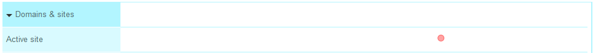

You will want to able to distinguish your features from those coming from our default data sources (if used). There are different ways to achieve that.

### Using a color
You can reuse the default categories and types. If you do so, in order to distinguish your data, you could specify a color for each one of your features.

```
{
  "type": "ACT_SITE",
  "category": "DOMAINS_AND_TYPES",
  "begin": 73,
  "end": 73,
  //Color used to distinguish from default data sources features
  "color": "#33CCFF"
}
```

So the previous active site and this one together would be rendered like:
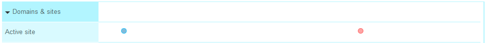


### Using customized categories or types
In addition to colors, you can also use your own categories or types. Let's consider the following features, coming from a customized data source.

```
//Predefined category, new type. Type label will be rendered as "Catalytic
site", feature will be a "#33CCFF" rectangle.
{
  "type": "CATALYTIC_SITE",
  "category": "DOMAINS_AND_SITES",
  "begin": 73,
  "end": 73,
  "color": "#33CCFF"
},

//Predefined category, new type. Type label will be rendered as "Tryptic
peptide", feature will be a "#B8008A" rectangle.
{
  "type": "TRYPTIC_PEPTIDE",
  "category": "PROTEOMICS",
  "begin": 13,
  "end": 20,
  "color": "#B8008A"
},

//Predefined category, new type. Type label will be rendered as
"Non-tryptic peptide", feature will be a "green"
rectangle.
{
  "type": "NON-TRYPTIC_PEPTIDE",
  "category": "PROTEOMICS",
  "begin": 127,
  "end": 135,
  "color": "green"
},

//Predefined category, new type. Type label will be rendered as "Tryptic
peptide", feature will be a "#B8008A"
rectangle.
{
  "type": "TRYPTIC_PEPTIDE",
  "category": "PROTEOMICS",
  "begin": 90,
  "end": 101,
  "color": "#B8008A"
},

//New category, new type. Category label will be rendered as "Novel
category", type label will be rendered as "Novel feature", feature
will be a **grey** rectangle as no color was specified.
{
  "type": "NOVEL_FEATURE",
  "category": "NOVEL_CATEGORY",
  "begin": 10,
  "end": 38
},

//New category, predefined type. Category label will be rendered
as "Modifications", type predefined label is "Glycosylation".
The predefined shape and color for CARBOHYD will be used.
{
  "type": "CARBOHYD",
  "category": "MODIFICATIONS",
  "begin": 101,
  "end": 101
},

//New category, predefined type. Category label will be rendered
as "Modifications", type predefined label is "Modified residue".
The predefined shape and color for MOD_RES will be used.
{
  "type": "MOD_RES",
  "category": "MODIFICATIONS",
  "begin": 711,
  "end": 711
}
```

If you omit the default data sources, this is how it would look.
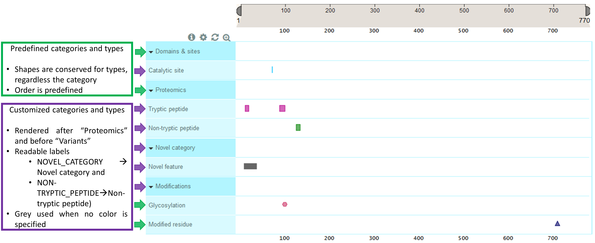


If you do load the default data sources, this is how it would look. Those features coming from the customized data source are circled in purple.
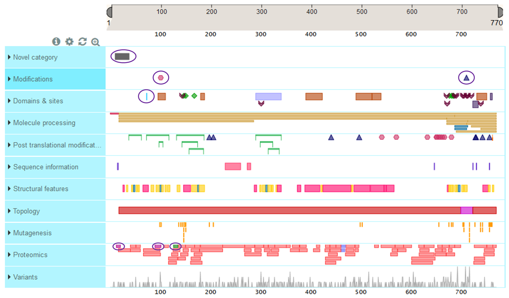

## Variants
Natural variants have a [tailored visualization](#variant-visualization) explained earlier in this document. In order to visually distinguish what variant data comes from an external source, i.e., sources you have added to the default ones, we use a thick colored border. The border color is given by the consequence reported on the external data source or black if none reported.
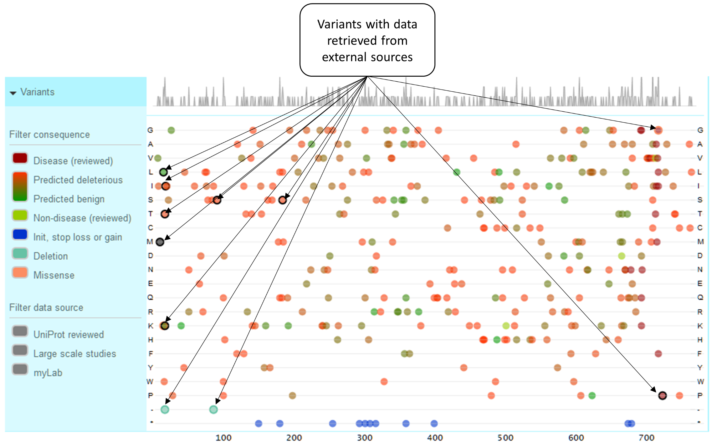

**Instantiation**

Both sources, the default and the external one, can report SIFT or Polyphen predictions. It is therefore **necessary** to specify at instantiation whether or not the default predictions should be overwritten.

The overwrite rules are like follows: If **overwritePredictions: false**, the predictions from the default data sources will be used whenever possible. If not available, then the predictions coming from the external data source will be used. The rules for **overwritePredictions: true** are similar but then the external data source has priority.

```
<div id='yourDiv'/>
<script>
  window.onload = function() {
    var yourDiv = document.getElementById('yourDiv');
    var ProtVista = require('ProtVista');
    var instance = new ProtVista({
      el: yourDiv,

      //This will be **always** added at the end of your data source URL
      uniprotacc: 'P05067',

      //Default sources will be included (even if this option is omitted)
      defaultSources: true,

      //Your data sources are defined here
      customDataSource: {
        url: 'https://mydomain/mysource/',
        source: 'myLab',
        //Should .json be added at the end of the request URL?
        useExtension: true
      },
      //Predictions defined in the default data sources will have priority over external sources
      overwritePredictions: false
    });
  }
</script>
```

**Position, prediction and coloring**

* If the position, the wild type and the alternative sequence are the same, we are talking about the same variant with information reported by different data sources.
**Example**: If two data sources report a variant P91S, only one circle will be used to represent the variable. The information coming from each data source will be available via tooltip.
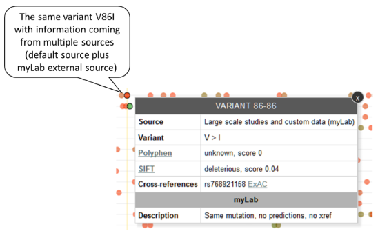

* We color variants according to its consequence (burgundy for disease, from red-ish for deleterious to green-ish for benign, and light green for non-disease). External sources can also report consequences for their variants; we will automatically assign a color to them.  All the reported consequences will be added to the consequence filter on the left. Please be aware that due to space limitations we cannot accommodate more than five consequence in addition to the default ones.

  * If the same variant is reported by the default and the external data source and the predictions reported by the default source have priority (**overwritePredictions: false**), only those predictions will be used to assign a color and will be shown in the tooltip. As the external data source has not reported a consequence, the border is black.
  **Example**: Variant P91S reported by both default and MyLab sources, default predictions have priority.
  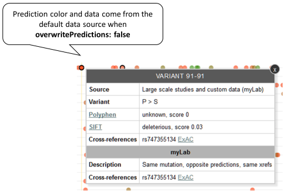

  * If the same variant is reported by the default and the external data source and the predictions reported by the default are overwritten (**overwritePredictions: true**), only the external predictions will be used to assign a color and will be shown in the tooltip. As the external data source has not reported a consequence, the border is black.
  **Example**: Variant P91S reported by both default and MyLab sources, external predictions have priority.
  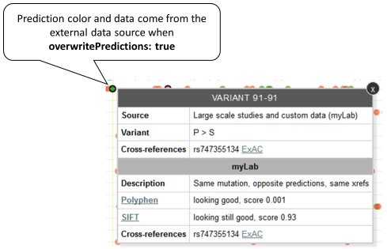

  * If the same variant is reported by the default and the external data source and the predictions reported by the default are overwritten (**overwritePredictions: true**), only the external predictions will be used to assign a color and will be shown in the tooltip. The consequence reported by the external data is used for the border color.
  **Example**: Variant P91S reported by both default and MyLab sources, external predictions have priority, external source reports a consequence.
  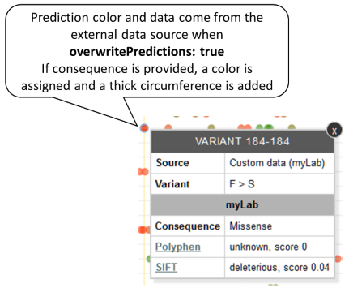

  * If a variant is reported by an external source with no prediction information but with a consequence, a color will be assigned to the consequence.
  **Example**: Variant A17del is reported by an external data source, the consequence is "deletion".
  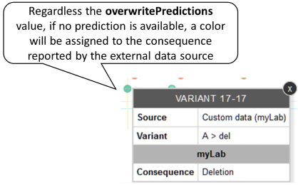

  * If a variant is reported by an external data source with no prediction nor consequence, black will be used to color such a variant.
  **Example**: Variant L10M reported by MyLab with no prediction nor consequence.
  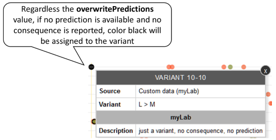

  * If a variant has a disease association, regardless any prediction data, burgundy will be used to color this variant.
  **Example**: MyLab reports a variant that, according to default data sources, is known to be associated to a disease.
  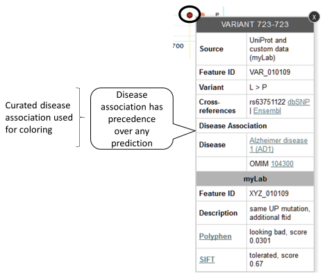

  * Blue is used for initiator codons and stop loss and gained.
  **Example**: Stop gained variant.
  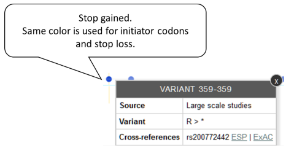

## Further customization

You will need to provide a configuration file if you want to:
* Change the predefined category order (e.g., you want first proteomics, then PTM's, then your modifications)
* Change the predefined labels for categories or types (e.g., you want to see "PTM's" rather than "Post translational modification")
* Change the automatic labels for customized categories or types (e.g., you want to see "Novelties" rather than "Novel category" for the custom category "NOVEL_CATEGORY")
* Change the predefined colors for types (e.g., you want to use #FF0000 rather than #FF0066 for "Helix")
* Use a color for your own types without explicitly specifying them in the data source response (e.g., you want to specify "green" for all of yours "catalytic sites" only once)

You can specify your configuration file as an option when instantiating ProtVista.

```html
<div id='yourDiv'/>
<script>
  window.onload = function() {
    var yourDiv = document.getElementById('yourDiv');
    var ProtVista = require('ProtVista');
    var instance = new ProtVista({
      el: yourDiv,
      uniprotacc: 'P05067',
      customDataSources: [
        {
          url: 'https://mydomain/mysource/',
          source: 'myLab',
          useExtension: true
        }
      ],
      customConfig: 'https://mydomain/mysource/myConfig.json'
    });
  }
</script>
```

### Default configuration
The default configuration file can be found at <https://github.com/ebi-uniprot/ProtVista/blob/master/src/config.json> . It is also provided inline here. Each category include a visualization type. The "basic" visualization type is used for all features but variants. For variants we have a specialized matrix-based visualization type "variant". No other types are currently supported.

If you need to use a configuration file, you will have to include there all categories and types to be configured.

```
{
  "categories": [
        {
          "name": "DOMAINS_AND_SITES",
          "label": "Domains & sites",
          "visualizationType": "basic"
        },
        {
          "name": "MOLECULE_PROCESSING",
          "label": "Molecule processing",
          "visualizationType": "basic"
        },
        {
          "name": "PTM",
          "label": "Post translational modifications",
          "visualizationType": "basic"
        },
        {
          "name": "SEQUENCE_INFORMATION",
          "label": "Sequence information",
          "visualizationType": "basic"
        },
        {
          "name": "STRUCTURAL",
          "label": "Structural features",
          "visualizationType": "basic"
        },
        {
          "name": "TOPOLOGY",
          "label": "Topology",
          "visualizationType": "basic"
        },
        {
          "name": "MUTAGENESIS",
          "label": "Mutagenesis",
          "visualizationType": "basic"
        },
        {
          "name": "PROTEOMICS",
          "label": "Proteomics",
          "visualizationType": "basic"
        },
        {
          "name": "VARIATION",
          "label": "Variants",
          "visualizationType": "variant"
        }
  ],
  "trackNames": {
    "chain": {
      "label": "Chain",
      "tooltip": "(aka mature region). This describes the extent of a polypeptide chain in the mature protein following processing"
    },
    "transit": {
      "label": "Transit peptide",
      "tooltip": "This describes the extent of a transit peptide"
    },
    "init_met": {
      "label": "Initiator methionine",
      "tooltip": "This indicates that the initiator methionine is cleaved from the mature protein"
    },
    "propep": {
      "label": "Propeptide",
      "tooltip": "Part of a protein that is cleaved during maturation or activation"
    },
    "peptide": {
      "label": "Peptide",
      "tooltip": "The position and length of an active peptide in the mature protein"
    },
    "signal": {
      "label": "Signal",
      "tooltip": "N-terminal signal peptide"
    },
    "helix": {
      "label": "Helix",
      "tooltip": "The positions of experimentally determined helical regions"
    },
    "strand": {
      "label": "Beta strand",
      "tooltip": "The positions of experimentally determined beta strands"
    },
    "turn": {
      "label": "Turn",
      "tooltip": "The positions of experimentally determined hydrogen-bonded turns"
    },
    "disulfid": {
      "label": "Disulfide bond",
      "tooltip": "The positions of cysteine residues participating in disulphide bonds"
    },
    "crosslnk": {
      "label": "Cross-link",
      "tooltip": "Covalent linkages of various types formed between two proteins or between two parts of the same protein"
    },
    "region": {
      "label": "Region",
      "tooltip": "Regions in multifunctional enzymes or fusion proteins, or characteristics of a region, e.g., protein-protein interactions mediation"
    },
    "coiled": {
      "label": "Coiled coil",
      "tooltip": "Coiled coils are built by two or more alpha-helices that wind around each other to form a supercoil"
    },
    "motif": {
      "label": "Motif",
      "tooltip": "Short conserved sequence motif of biological significance"
    },
    "repeat": {
      "label": "Repeat",
      "tooltip": "Repeated sequence motifs or repeated domains within the protein"
    },
    "ca_bind": {
      "label": "Calcium binding",
      "tooltip": "Calcium-binding regions, such as the EF-hand motif"
    },
    "dna_bind": {
      "label": "DNA binding",
      "tooltip": "DNA-binding domains such as AP2/ERF domain, the ETS domain, the Fork-Head domain, the HMG box and the Myb domain"
    },
    "domain": {
      "label": "Domain",
      "tooltip": "Specific combination of secondary structures organized into a characteristic three-dimensional structure or fold"
    },
    "zn_fing": {
      "label": "Zinc finger",
      "tooltip": "Small, functional, independently folded domain that coordinates one or more zinc ions"
    },
    "np_bind": {
      "label": "Nucleotide binding",
      "tooltip": "(aka flavin-binding). Region in the protein which binds nucleotide phosphates"
    },
    "metal": {
      "label": "Metal binding",
      "tooltip": "Binding site for a metal ion"
    },
    "site": {
      "label": "Site",
      "tooltip": "Any interesting single amino acid site on the sequence"
    },
    "binding": {
      "label": "Binding site",
      "tooltip": "Binding site for any chemical group (co-enzyme, prosthetic group, etc.)"
    },
    "act_site": {
      "label": "Active site",
      "tooltip": "Amino acid(s) directly involved in the activity of an enzyme"
    },
    "mod_res": {
      "label": "Modified residue",
      "tooltip": "Modified residues such as phosphorylation, acetylation, acylation, methylation"
    },
    "lipid": {
      "label": "Lipidation",
      "tooltip": "Covalently attached lipid group(s)"
    },
    "carbohyd": {
      "label": "Glycosylation",
      "tooltip": "Covalently attached glycan group(s)"
    },
    "compbias": {
      "label": "Compositional bias",
      "tooltip": "Position of regions of compositional bias within the protein and the particular amino acids that are over-represented within those regions"
    },
    "conflict": {
      "label": "Sequence conflict",
      "tooltip": "Sequence discrepancies of unknown origin"
    },
    "non_cons": {
      "label": "Non-adjacent residues",
      "tooltip": "Indicates that two residues in a sequence are not consecutive and that there is an undetermined number of unsequenced residues between them"
    },
    "non_ter": {
      "label": "Non-terminal residue",
      "tooltip": "The sequence is incomplete. The residue is not the terminal residue of the complete protein"
    },
    "unsure": {
      "label": "Sequence uncertainty",
      "tooltip": "Regions of a sequence for which the authors are unsure about the sequence assignment"
    },
    "non_std": {
      "label": "Non-standard residue",
      "tooltip": "Non-standard amino acids (selenocysteine and pyrrolysine)"
    },
    "mutagen": {
      "label": "Mutagenesis",
      "tooltip": "Site which has been experimentally altered by mutagenesis"
    },
    "topo_dom": {
      "label": "Topological domain",
      "tooltip": "Location of non-membrane regions of membrane-spanning proteins"
    },
    "transmem": {
      "label": "Transmembrane",
      "tooltip": "Extent of a membrane-spanning region"
    },
    "intramem": {
      "label": "Intramembrane",
      "tooltip": "Extent of a region located in a membrane without crossing it"
    },
    "variant": {
      "label": "Natural variant",
      "tooltip": "Natural variant of the protein, including polymorphisms, variations between strains, isolates or cultivars, disease-associated mutations and RNA editing events"
    },
    "unique": {
      "label": "Unique peptide",
      "tooltip": ""
    },
    "non_unique": {
      "label": "Non-unique peptide",
      "tooltip": ""
    }
  }
}
```

### Customized configuration
If you want, for instance, to localize your custom category MODIFICATIONS below PTM and change the default yellow-brown-ish color to a pinky one for the feature type CHAIN, you would need to modify and provide a configuration file.

You could get then a visualization like
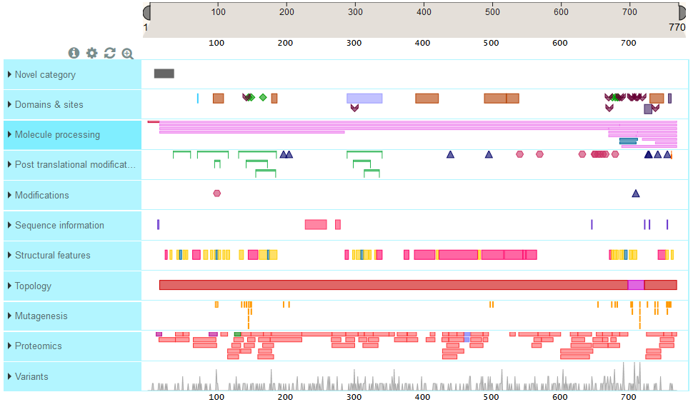

# Contributing
Please submit all issues and pull requests to the [ebi-uniprot/ProtVista](http://github.com/ebi-uniprot/ProtVista) repository!

# Support
If you have any problem or suggestion please open an issue [here](https://github.com/ebi-uniprot/ProtVista/issues).

## License
This software is licensed under the Apache 2 license, quoted below.

Copyright (c) 2014, ebi-uniprot

Licensed under the Apache License, Version 2.0 (the "License"); you may not
use this file except in compliance with the License. You may obtain a copy of
the License at

    http://www.apache.org/licenses/LICENSE-2.0

Unless required by applicable law or agreed to in writing, software
distributed under the License is distributed on an "AS IS" BASIS, WITHOUT
WARRANTIES OR CONDITIONS OF ANY KIND, either express or implied. See the
License for the specific language governing permissions and limitations under
the License.
